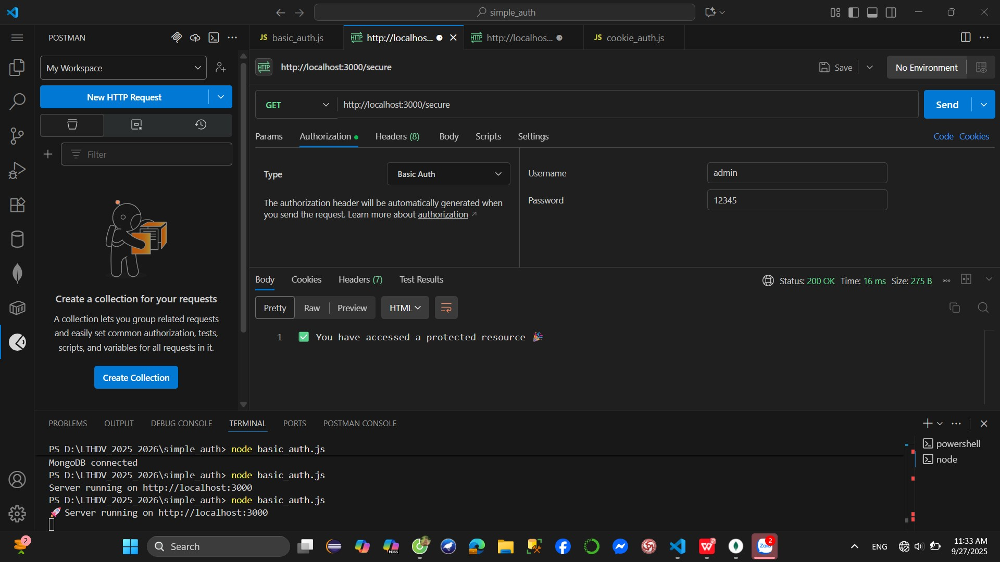
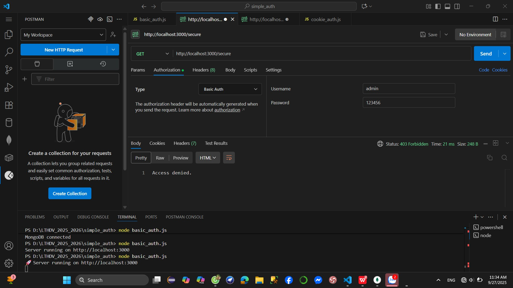
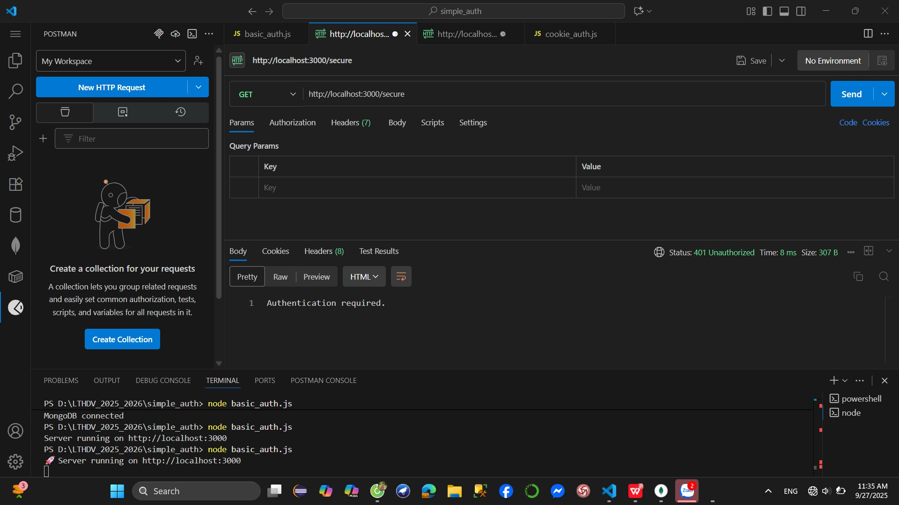
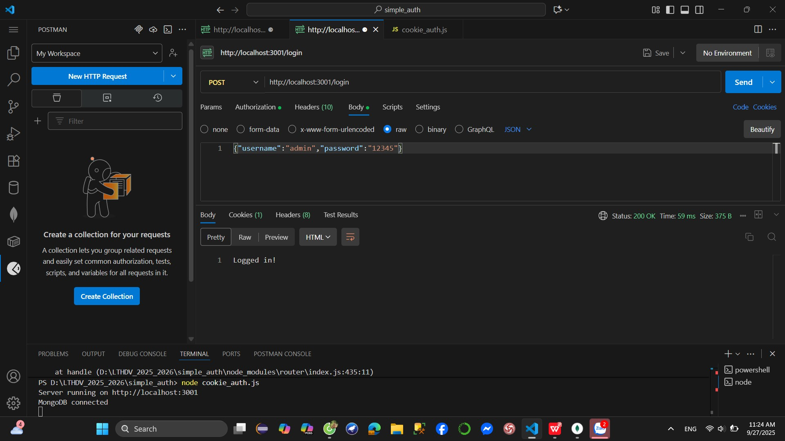
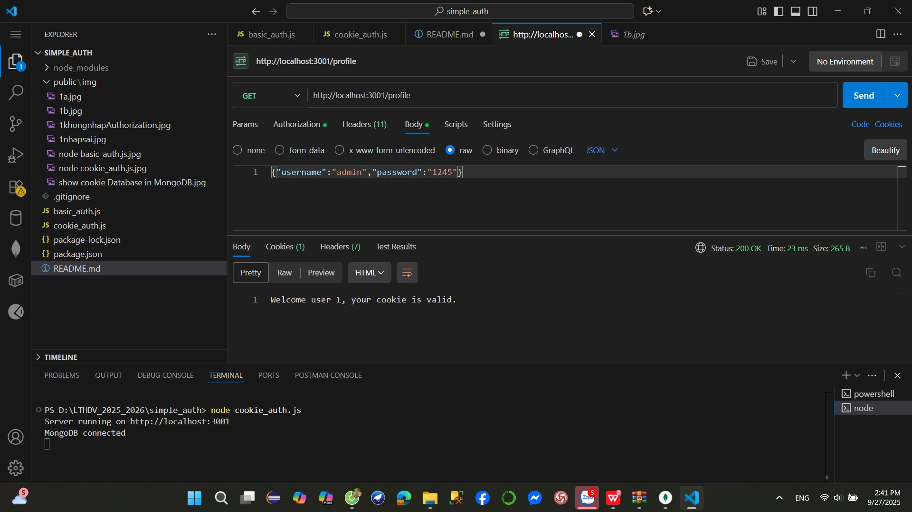

Lab 6 - Simple Authentication in Node.js
This lab demonstrates two authentication methods using Node.js and Express:

Basic Authentication (with hardcoded username/password).
Cookie-based Authentication (with session cookies stored in MongoDB).
The source code is provided by the lecturer. Below are the instructions to run and test the APIs using Postman.

Part A: Basic Authentication
1. Run the Server
node basic_auth.js
Server will run on: http://localhost:3000

Test with Postman
(a) Public Routes
In file Public/img you will see results 1a.img
GET http://localhost:3000/ → response: Welcome! Visit first public resource.

GET http://localhost:3000/secure

You must add Authorization header in the request:

Key: Authorization
Value: Basic base64(username:password)

Example with username=admin, password=12345:

Authorization: Basic YWRtaW46MTIzNDU=
👉 Valid credentials:

You have accessed a protected resource 🎉

👉 Invalid credentials:

403 Access denied.

👉 No credentials:

401 Authentication required.

## Part B: Cookie Authentication
1. Run the Server

Start MongoDB first:

mongod

Then run:

node cookie_auth.js

👉 Server will run on: http://localhost:3001

2. Test with Postman
(a) Login (to receive cookie)

Method: POST

URL: http://localhost:3001/login

Body (JSON):

{
  "username": "admin",
  "password": "12345"
}

👉 Response: Logged in!

👉 Cookie auth_cookie_token will be set (check in Postman tab Cookies).

(b) Access Protected Route

Method: GET

URL: http://localhost:3001/profile

👉 With valid cookie:

Welcome user 1, your cookie is valid.

👉 Without cookie / expired cookie (after 5 mins):

401 Unauthorized

(c) Logout

Method: POST

URL: http://localhost:3001/logout

👉 Response:

Logged out.

👉 Cookie will be removed from browser and deleted from MongoDB.
Summary

Basic Authentication: Uses Authorization header with Base64 encoded credentials.

Cookie Authentication: Uses login to create a session stored in MongoDB, client must send cookie to access protected routes.
